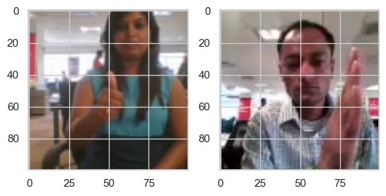
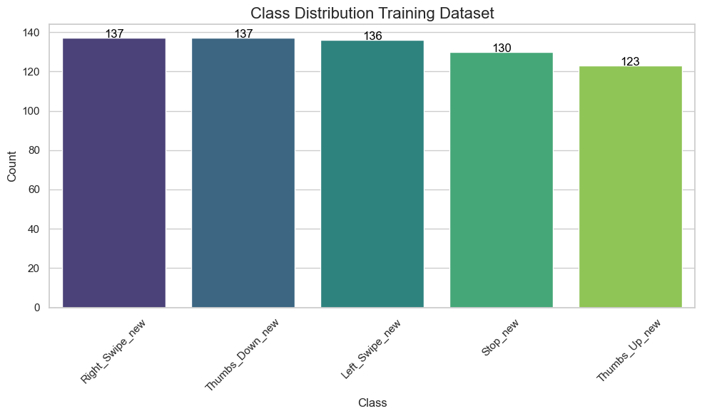
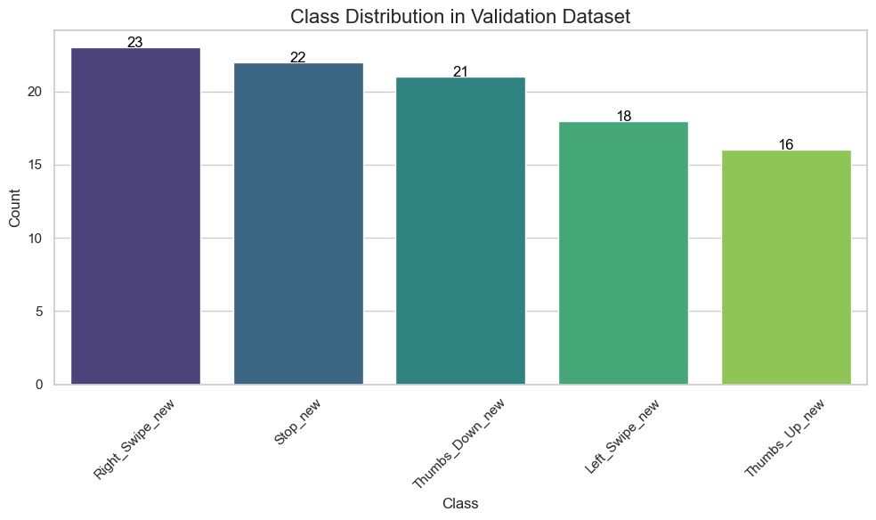

# CNN + LSTM Sequential Frame Classification

## Overview
This repository implements a deep learning model that performs classification on sequential frames using a combination of **CNN** for spatial feature extraction and **LSTM** for temporal feature extraction. The project explores different techniques including basic CNN + LSTM, transfer learning using pre-trained models, and data augmentation to enhance the model's performance.

# Gesture Recognition: Hand Gestures for Controlling a Television
## About this Dataset

This dataset contains a collection of hand gestures used to control a television. Each gesture is represented as a sequence of 30 frames (images). The dataset includes the following gestures, each corresponding to a specific command:

- **Thumbs Up**: Increase the volume
- **Thumbs Down**: Decrease the volume
- **Left Swipe**: Jump backward 10 seconds
- **Right Swipe**: Jump forward 10 seconds
- **Stop**: Pause the movie

Each gesture is recorded in video format, with each video consisting of 30 frames. The data is organized into two main folders:

- **train**: Training data
- **val**: Validation data

Within each folder, there are subfolders representing individual videos, each of which contains a sequence of 30 frames for a particular gesture. The images in each video subfolder have the same dimensions, although videos may have different dimensions depending on the webcam used for recording. Specifically, there are two types of video dimensions:

- **360x360** (larger resolution)
- **120x160** (smaller resolution)

### Folder Structure

- **train/**
    - **[gesture1]/**
        - frame1.jpg
        - frame2.jpg
        - ...
        - frame30.jpg
    - **[gesture2]/**
        - frame1.jpg
        - frame2.jpg
        - ...
        - frame30.jpg
    - ...
  
- **val/**
    - **[gesture1]/**
        - frame1.jpg
        - frame2.jpg
        - ...
        - frame30.jpg
    - **[gesture2]/**
        - frame1.jpg
        - frame2.jpg
        - ...
        - frame30.jpg
    - ...

### Key Features:
- **Basic CNN + LSTM**: A custom CNN architecture coupled with LSTM layers to capture temporal dependencies in sequential frames.
- **Transfer Learning**: Using pre-trained models (e.g., ResNet, VGG) to improve feature extraction capabilities, followed by LSTM for temporal extraction.
- **Data Augmentation**: Applying various augmentations such as flipping, rotating, and cropping to increase the robustness of the model.
- **End-to-End Pipeline**: From loading data, augmenting it, training the model, and evaluating performance.

### Example Images

Here are some example images from the dataset:

- **Random Images**: 2 random images
  

Here are some stats for the training dataset before data augmenting:

- **Training data**: train
  

Here are some stats for the validation dataset before data augmenting:
- **Validation data**: val
  

### Credits

This dataset and the inspiration has come from Kaggle, and is available for use in gesture recognition tasks. Special thanks to **Sparsh** for his inspiring work and resources shared in the following Kaggle notebook, which served as a valuable reference for this implementation:

[Gesture Recognition using Conv3D, Conv2D, and RNN](https://www.kaggle.com/code/imsparsh/gesture-recognition-conv3d-conv2d-rnn)

